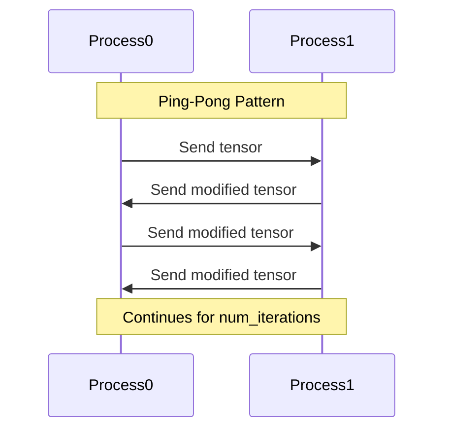
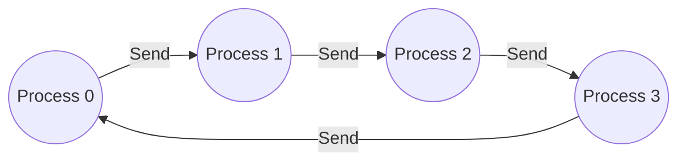

# Point-to-Point Communication in PyTorch

## Introduction

Point-to-point communication refers to the direct exchange of data between two processes in a distributed computing environment. It forms the fundamental building block for more complex communication patterns and algorithms in parallel computing.


In this tutorial, we'll explore point-to-point communication using PyTorch's distributed communication package (`torch.distributed`), with a focus on:

1. Basic send/receive operations
2. Blocking vs. non-blocking communication
3. Point-to-point communication patterns
4. Performance considerations and optimization techniques

## Prerequisites

Before diving into the examples, you'll need:

- PyTorch installed (version 1.8+)
- Basic understanding of distributed computing concepts
- Multiple CPU cores or GPUs for practical execution

## 1. Basic Point-to-Point Communication

### 1.1 Setting Up the Distributed Environment

The first step is to initialize the distributed environment:

```python
import os
import torch
import torch.distributed as dist

def setup(rank, world_size):
    """
    Initialize the distributed environment.
    
    Args:
        rank: Unique ID assigned to the current process
        world_size: Total number of processes
    """
    os.environ['MASTER_ADDR'] = 'localhost'
    os.environ['MASTER_PORT'] = '12355'
    
    # Initialize the process group
    dist.init_process_group("gloo", rank=rank, world_size=world_size)
    print(f"Rank {rank}/{world_size} initialized")

def cleanup():
    """
    Clean up the distributed environment.
    """
    dist.destroy_process_group()
```

### 1.2 Simple Send and Receive

The most basic point-to-point operations are `send` and `recv`:

```python
import torch.multiprocessing as mp

def simple_send_recv(rank, world_size):
    # Initialize process group
    setup(rank, world_size)
    
    tensor_size = 10
    
    if rank == 0:
        # Process 0 sends data
        tensor = torch.randn(tensor_size)
        print(f"Rank {rank} sending tensor: {tensor}")
        dist.send(tensor=tensor, dst=1)
        
    elif rank == 1:
        # Process 1 receives data
        tensor = torch.zeros(tensor_size)
        dist.recv(tensor=tensor, src=0)
        print(f"Rank {rank} received tensor: {tensor}")
    
    # Clean up
    cleanup()

# Run the example with 2 processes
if __name__ == "__main__":
    world_size = 2
    mp.spawn(simple_send_recv,
             args=(world_size,),
             nprocs=world_size,
             join=True)
```

In this example:
- Process 0 creates a random tensor and sends it to process 1
- Process 1 creates an empty tensor and receives the data from process 0

This communication is **blocking**, meaning that both processes will wait until the communication is complete before proceeding.

## 2. Blocking vs. Non-Blocking Communication

### 2.1 Blocking Communication

The previous example demonstrates blocking communication, where:
- `send()` blocks until the receiving process has started receiving the data
- `recv()` blocks until the data has been received

This synchronization can lead to inefficiencies, especially when processes need to perform other computations while waiting.

### 2.2 Non-Blocking Communication

PyTorch provides non-blocking alternatives with `isend()` and `irecv()`, which return immediately and allow the process to continue execution:

```python
def non_blocking_send_recv(rank, world_size):
    # Initialize process group
    setup(rank, world_size)
    
    tensor_size = 10
    
    if rank == 0:
        # Process 0 sends data
        send_tensor = torch.randn(tensor_size)
        print(f"Rank {rank} sending tensor: {send_tensor}")
        
        # Non-blocking send returns a work handle
        req = dist.isend(tensor=send_tensor, dst=1)
        
        # Do other work here while communication happens in background
        print(f"Rank {rank} doing other work while sending...")
        
        # Wait for the communication to complete
        req.wait()
        print(f"Rank {rank} send completed")
        
    elif rank == 1:
        # Process 1 receives data
        recv_tensor = torch.zeros(tensor_size)
        
        # Non-blocking receive returns a work handle
        req = dist.irecv(tensor=recv_tensor, src=0)
        
        # Do other work here while waiting for data
        print(f"Rank {rank} doing other work while receiving...")
        
        # Wait for the communication to complete
        req.wait()
        print(f"Rank {rank} received tensor: {recv_tensor}")
    
    # Clean up
    cleanup()
```

This approach allows processes to overlap communication with computation, potentially improving performance.

## 3. Point-to-Point Communication Patterns

### 3.1 Ping-Pong Pattern

The ping-pong pattern involves two processes alternately sending and receiving data:

```python
def ping_pong(rank, world_size):
    # Initialize process group
    setup(rank, world_size)
    
    num_iterations = 5
    tensor_size = 10
    
    if rank == 0:
        tensor = torch.ones(tensor_size)
        print(f"Rank {rank} starting value: {tensor}")
        
        for i in range(num_iterations):
            # Send to process 1
            dist.send(tensor=tensor, dst=1)
            print(f"Rank {rank} sent iteration {i}: {tensor}")
            
            # Receive from process 1
            dist.recv(tensor=tensor, src=1)
            print(f"Rank {rank} received iteration {i}: {tensor}")
            
            # Modify tensor (add 1 to each element)
            tensor += 1
            
    elif rank == 1:
        tensor = torch.zeros(tensor_size)
        
        for i in range(num_iterations):
            # Receive from process 0
            dist.recv(tensor=tensor, src=0)
            print(f"Rank {rank} received iteration {i}: {tensor}")
            
            # Modify tensor (multiply each element by 2)
            tensor *= 2
            
            # Send to process 0
            dist.send(tensor=tensor, dst=0)
            print(f"Rank {rank} sent iteration {i}: {tensor}")
    
    # Clean up
    cleanup()
```

This pattern is commonly used for:
- Testing network latency
- Implementing iterative algorithms that require alternating updates



### 3.2 Pipeline Pattern

The pipeline pattern involves passing data through a sequence of processes, with each process performing some computation:

```python
def pipeline(rank, world_size):
    # Initialize process group
    setup(rank, world_size)
    
    tensor_size = 10
    
    if rank == 0:
        # Process 0: Generate initial data
        tensor = torch.randn(tensor_size)
        print(f"Rank {rank} generated: {tensor}")
        
        # Send to next process in pipeline
        dist.send(tensor=tensor, dst=1)
        print(f"Rank {rank} sent to next process")
        
        # Receive final result from last process
        dist.recv(tensor=tensor, src=world_size-1)
        print(f"Rank {rank} received final result: {tensor}")
        
    else:
        # Middle processes receive, transform, and send
        tensor = torch.zeros(tensor_size)
        
        # Receive from previous process
        dist.recv(tensor=tensor, src=rank-1)
        print(f"Rank {rank} received: {tensor}")
        
        # Apply transformation (example: add rank to each element)
        tensor += rank
        print(f"Rank {rank} transformed: {tensor}")
        
        # Send to next process (or back to process 0 if last)
        next_rank = (rank + 1) % world_size
        dist.send(tensor=tensor, dst=next_rank)
        print(f"Rank {rank} sent to rank {next_rank}")
    
    # Clean up
    cleanup()
```

The pipeline pattern is useful for:
- Processing large datasets in stages
- Implementing neural network layers across multiple devices


## 4. Performance Optimization

### 4.1 Using Different Communication Backends

PyTorch supports multiple communication backends:

```python
def using_nccl_backend(rank, world_size):
    # For GPU communication, NCCL backend is often fastest
    os.environ['MASTER_ADDR'] = 'localhost'
    os.environ['MASTER_PORT'] = '12355'
    
    # Initialize with NCCL backend for GPU
    dist.init_process_group("nccl", rank=rank, world_size=world_size)
    
    # Move tensors to GPU
    device = torch.device(f"cuda:{rank}")
    tensor_size = 10
    
    if rank == 0:
        tensor = torch.randn(tensor_size, device=device)
        dist.send(tensor=tensor, dst=1)
    else:
        tensor = torch.zeros(tensor_size, device=device)
        dist.recv(tensor=tensor, src=0)
    
    # Clean up
    dist.destroy_process_group()
```

Choosing the right backend:
- **GLOO**: Works on both CPU and GPU, good for development
- **NCCL**: Optimized for GPU-to-GPU communication
- **MPI**: Good for CPU communication with existing MPI infrastructure

### 4.2 Optimizing Large Data Transfers

For large data transfers, consider:

```python
def transfer_large_data(rank, world_size):
    # Initialize process group
    setup(rank, world_size)
    
    # Large tensor size
    tensor_size = 10000000  # 10M elements
    
    if rank == 0:
        large_tensor = torch.randn(tensor_size)
        
        # Option 1: Split into chunks for better memory management
        chunk_size = 1000000  # 1M elements
        num_chunks = tensor_size // chunk_size
        
        for i in range(num_chunks):
            start_idx = i * chunk_size
            end_idx = (i + 1) * chunk_size
            chunk = large_tensor[start_idx:end_idx]
            
            # Send chunk
            req = dist.isend(tensor=chunk, dst=1)
            req.wait()
            
            print(f"Rank {rank} sent chunk {i+1}/{num_chunks}")
            
    elif rank == 1:
        # Allocate full tensor
        received_tensor = torch.zeros(tensor_size)
        chunk_size = 1000000  # 1M elements
        num_chunks = tensor_size // chunk_size
        
        for i in range(num_chunks):
            start_idx = i * chunk_size
            end_idx = (i + 1) * chunk_size
            chunk = received_tensor[start_idx:end_idx]
            
            # Receive chunk
            req = dist.irecv(tensor=chunk, src=0)
            req.wait()
            
            # Copy chunk data into the full tensor
            received_tensor[start_idx:end_idx] = chunk
            
            print(f"Rank {rank} received chunk {i+1}/{num_chunks}")
    
    # Clean up
    cleanup()
```

This approach helps:
- Avoid memory bottlenecks
- Provide better progress reporting
- Allow overlapping communication with computation

## 5. Advanced Point-to-Point Patterns

### 5.1 Implementing a Ring Communication Pattern

A ring communication pattern involves each process communicating with its neighbors in a circular fashion:

```python
def ring_communication(rank, world_size):
    # Initialize process group
    setup(rank, world_size)
    
    tensor_size = 10
    
    # Create a tensor with values specific to this rank
    send_tensor = torch.ones(tensor_size) * rank
    recv_tensor = torch.zeros(tensor_size)
    
    # Determine left and right neighbors in the ring
    left_neighbor = (rank - 1) % world_size
    right_neighbor = (rank + 1) % world_size
    
    # First send to right, then receive from left
    if rank % 2 == 0:
        # Even ranks: send first, then receive
        req_send = dist.isend(tensor=send_tensor, dst=right_neighbor)
        req_recv = dist.irecv(tensor=recv_tensor, src=left_neighbor)
    else:
        # Odd ranks: receive first, then send
        req_recv = dist.irecv(tensor=recv_tensor, src=left_neighbor)
        req_send = dist.isend(tensor=send_tensor, dst=right_neighbor)
    
    # Wait for completion
    req_send.wait()
    req_recv.wait()
    
    print(f"Rank {rank} sent {send_tensor} to rank {right_neighbor}")
    print(f"Rank {rank} received {recv_tensor} from rank {left_neighbor}")
    
    # Clean up
    cleanup()
```

Ring communication is useful for:
- Implementing distributed algorithms like Ring-AllReduce
- Neighborhood-based computations in simulation



All together

```mermaid
graph TD
    subgraph "Basic Point-to-Point"
        P0[Process 0] -->|Send| P1[Process 1]
        P1 -->|Send| P0
    end
    
    subgraph "Ping-Pong Pattern"
        PP0[Process 0] -->|1. Send| PP1[Process 1]
        PP1 -->|2. Process & Send Back| PP0
        PP0 -->|3. Process & Send Again| PP1
    end
    
    subgraph "Pipeline Pattern"
        Pipe0[Process 0] -->|Initial Data| Pipe1[Process 1]
        Pipe1 -->|Transformed Data| Pipe2[Process 2] 
        Pipe2 -->|Transformed Data| Pipe3[Process 3]
        Pipe3 -->|Final Result| Pipe0
    end
    
    subgraph "Ring Communication"
        R0((Process 0)) -->|Send| R1((Process 1))
        R1 -->|Send| R2((Process 2)) 
        R2 -->|Send| R3((Process 3))
        R3 -->|Send| R0
    end
```

## Conclusion

Point-to-point communication forms the foundation of distributed computing with PyTorch. Understanding these principles enables you to build more complex communication patterns and implement efficient parallel algorithms.

Key takeaways:
1. Basic `send` and `recv` operations provide simple but synchronous communication
2. Non-blocking operations (`isend`, `irecv`) enable overlapping communication with computation
3. Common patterns like ping-pong and pipeline can be implemented with these primitives
4. Performance can be optimized by choosing the right backend and managing large transfers effectively
5. Advanced patterns like ring communication build upon the basic operations

With these fundamentals, you can develop sophisticated distributed applications and algorithms using PyTorch's communication capabilities.
