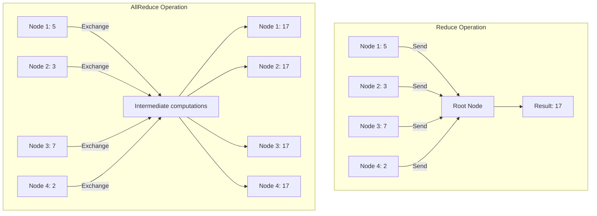
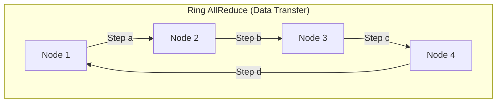
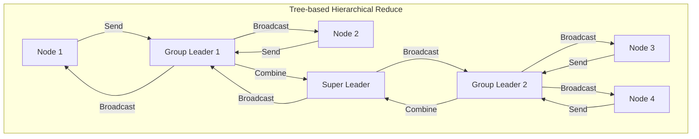
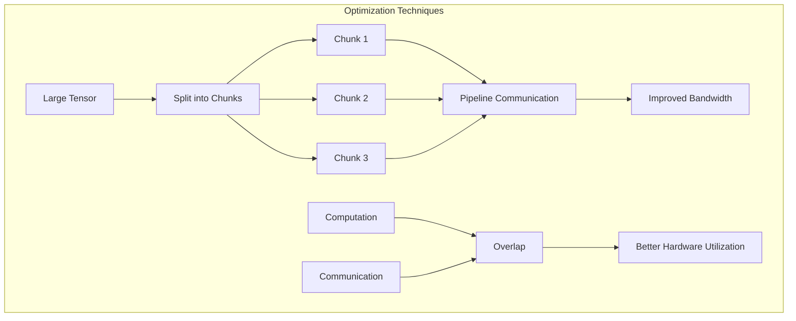
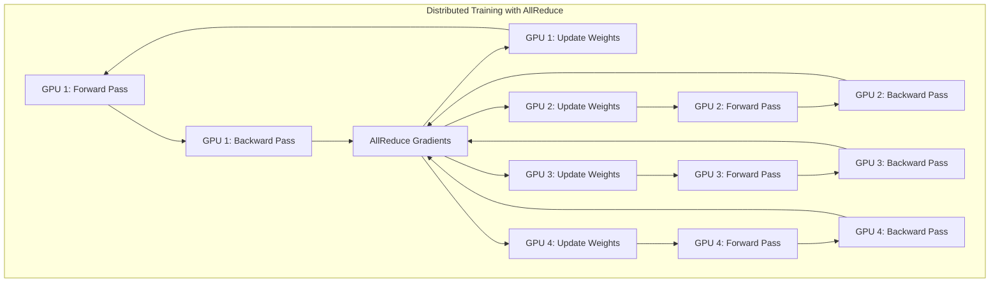

# Distributed Computing in PyTorch: Reduce & AllReduce Operations

Distributed computing is essential for training large-scale models across multiple devices or nodes. PyTorch provides powerful primitives for distributed communication, with **Reduce** and **AllReduce** being fundamental collective operations. This tutorial will guide you through these operations from basic concepts to advanced implementations.

## Table of Contents
1. [Understanding Reduce and AllReduce](#understanding-reduce-and-allreduce)
2. [Setting Up the Distributed Environment](#setting-up-the-distributed-environment)
3. [Basic Reduce Operation](#basic-reduce-operation)
4. [Basic AllReduce Operation](#basic-allreduce-operation)
5. [Ring AllReduce Implementation](#ring-allreduce-implementation)
6. [Hierarchical AllReduce](#hierarchical-allreduce)
7. [Performance Optimization](#performance-optimization)
8. [Real-world Applications](#real-world-applications)
9. [Advanced Techniques](#advanced-techniques)

## Understanding Reduce and AllReduce

### Reduce Operation
In the Reduce operation, data from all processes is combined using a specified operation (like sum, max, min, etc.), and the result is sent to a designated root process only.

### AllReduce Operation
AllReduce extends the Reduce operation by distributing the final result back to all processes. After the operation completes, every process has access to the combined result.

These operations are critical for distributed training where processes need to synchronize gradients or other data.

### Visual Representation



## Setting Up the Distributed Environment

Before we can use Reduce or AllReduce operations, we need to set up the PyTorch distributed environment:

```python
import os
import torch
import torch.distributed as dist
import torch.multiprocessing as mp

def setup(rank, world_size):
    """
    Initialize the distributed environment.
    
    Args:
        rank: Unique identifier for the process
        world_size: Total number of processes
    """
    os.environ['MASTER_ADDR'] = 'localhost'
    os.environ['MASTER_PORT'] = '12355'
    
    # Initialize the process group
    dist.init_process_group("gloo", rank=rank, world_size=world_size)
    
def cleanup():
    """
    Clean up the distributed environment.
    """
    dist.destroy_process_group()
```

## Basic Reduce Operation

The Reduce operation combines tensors from all processes using a specified operation and sends the result to a designated root process.

```python
def reduce_example(rank, world_size):
    """
    Basic example of reduce operation.
    
    Args:
        rank: Process rank
        world_size: Total number of processes
    """
    # Setup the distributed environment
    setup(rank, world_size)
    
    # Create a tensor with a value based on the rank
    tensor = torch.tensor([float(rank + 1)], device=torch.device('cpu'))
    print(f"Rank {rank} has data: {tensor.item()}")
    
    # Define the root rank where results will be collected
    root_rank = 0
    
    # Allocate a tensor to store the result on the root process
    if rank == root_rank:
        reduced_tensor = torch.zeros_like(tensor)
    else:
        reduced_tensor = None
    
    # Perform the reduce operation
    dist.reduce(tensor, dst=root_rank, op=dist.ReduceOp.SUM)
    
    if rank == root_rank:
        print(f"Rank {rank} has reduced result: {tensor.item()}")
    
    # Clean up
    cleanup()

if __name__ == "__main__":
    # Number of processes
    world_size = 4
    
    # Create processes
    mp.spawn(reduce_example, args=(world_size,), nprocs=world_size, join=True)
```

## Basic AllReduce Operation

The AllReduce operation is similar to Reduce, but the final result is distributed to all processes.

```python
def allreduce_example(rank, world_size):
    """
    Basic example of allreduce operation.
    
    Args:
        rank: Process rank
        world_size: Total number of processes
    """
    # Setup the distributed environment
    setup(rank, world_size)
    
    # Create a tensor with a value based on the rank
    tensor = torch.tensor([float(rank + 1)], device=torch.device('cpu'))
    print(f"Rank {rank} has data: {tensor.item()}")
    
    # Perform the allreduce operation
    dist.all_reduce(tensor, op=dist.ReduceOp.SUM)
    
    # Now all processes have the same value
    print(f"After AllReduce, rank {rank} has data: {tensor.item()}")
    
    # Clean up
    cleanup()

if __name__ == "__main__":
    # Number of processes
    world_size = 4
    
    # Create processes
    mp.spawn(allreduce_example, args=(world_size,), nprocs=world_size, join=True)
```

## Ring AllReduce Implementation

The Ring AllReduce algorithm is an efficient implementation that minimizes communication overhead. It consists of two phases: the scatter-reduce phase and the allgather phase.



In the scatter-reduce phase, each node sends a chunk of its data to its neighbor in the ring and receives a chunk from another neighbor. After all steps, each node has a fully reduced chunk of the final result. In the allgather phase, these reduced chunks are shared so that every node obtains the complete result.

```python
def ring_allreduce(rank, world_size):
    """
    Implementation of Ring AllReduce algorithm.
    
    Args:
        rank: Process rank
        world_size: Total number of processes
    """
    # Setup the distributed environment
    setup(rank, world_size)
    
    # Create a tensor with value based on rank
    tensor_size = 4  # For simplicity, each process has a tensor of size 4
    tensor = torch.ones(tensor_size) * (rank + 1)
    print(f"Rank {rank} initial data: {tensor}")
    
    # Make a copy for verification
    original_tensor = tensor.clone()
    
    # Allocate memory for receiving data
    recv_buffer = torch.zeros_like(tensor)
    
    # Calculate the expected result for verification
    expected_result = sum([(i + 1) for i in range(world_size)]) * torch.ones_like(tensor)
    
    # ====== Scatter-Reduce Phase ======
    # In this phase, each process sends and receives data chunks
    # After this phase, each process has a chunk of the final reduced result
    for step in range(world_size - 1):
        # Calculate source and destination ranks
        send_rank = (rank - step) % world_size
        recv_rank = (rank - step - 1) % world_size
        
        # Send and receive data
        if rank % 2 == 0:  # Even ranks send first, then receive
            dist.send(tensor, send_rank)
            dist.recv(recv_buffer, recv_rank)
        else:  # Odd ranks receive first, then send
            dist.recv(recv_buffer, recv_rank)
            dist.send(tensor, send_rank)
        
        # Update tensor with received data
        tensor += recv_buffer
    
    # ====== AllGather Phase ======
    # Now each process has a chunk of the final result
    # We need to share these chunks with all processes
    for step in range(world_size - 1):
        # Calculate source and destination ranks
        send_rank = (rank - step - 1) % world_size
        recv_rank = (rank - step - 2) % world_size
        
        # Send and receive data
        if rank % 2 == 0:
            dist.send(tensor, send_rank)
            dist.recv(tensor, recv_rank)
        else:
            dist.recv(recv_buffer, recv_rank)
            dist.send(tensor, send_rank)
            tensor = recv_buffer.clone()
    
    print(f"Rank {rank} after Ring AllReduce: {tensor}")
    print(f"Expected result: {expected_result}")
    print(f"Correct: {torch.allclose(tensor, expected_result)}")
    
    # Clean up
    cleanup()

if __name__ == "__main__":
    world_size = 4
    mp.spawn(ring_allreduce, args=(world_size,), nprocs=world_size, join=True)
```

## Hierarchical AllReduce

For large-scale distributed systems, a hierarchical approach to AllReduce can be more efficient. This involves organizing processes into groups and performing AllReduce within and across these groups.



In this approach, nodes are first organized into local groups where they perform local reduction operations. Then, representatives from each group (group leaders) exchange information across groups. Finally, the complete result is broadcast back through the hierarchy to all nodes.

```python
def hierarchical_allreduce(rank, world_size):
    """
    Implementation of hierarchical AllReduce.
    
    Args:
        rank: Process rank
        world_size: Total number of processes
    """
    # Setup the distributed environment
    setup(rank, world_size)
    
    # Create data tensor
    tensor = torch.ones(4) * (rank + 1)
    print(f"Rank {rank} initial data: {tensor}")
    
    # Define the number of groups
    num_groups = 2  # Assuming world_size is divisible by num_groups
    group_size = world_size // num_groups
    
    # Create process groups
    groups = []
    for i in range(num_groups):
        group_ranks = list(range(i * group_size, (i + 1) * group_size))
        group = dist.new_group(group_ranks)
        groups.append(group)
    
    # Determine which group this process belongs to
    group_id = rank // group_size
    local_group = groups[group_id]
    
    # Step 1: AllReduce within the local group
    dist.all_reduce(tensor, op=dist.ReduceOp.SUM, group=local_group)
    print(f"Rank {rank} after local group AllReduce: {tensor}")
    
    # Step 2: Choose a representative from each group for cross-group AllReduce
    is_representative = (rank % group_size) == 0
    cross_group_ranks = list(range(0, world_size, group_size))
    
    if is_representative:
        # Create a cross-group
        cross_group = dist.new_group(cross_group_ranks)
        
        # Perform AllReduce across group representatives
        dist.all_reduce(tensor, op=dist.ReduceOp.SUM, group=cross_group)
        
        print(f"Rank {rank} after cross-group AllReduce: {tensor}")
    
    # Step 3: Broadcast the result from the representative to all group members
    dist.broadcast(tensor, src=group_id * group_size, group=local_group)
    
    print(f"Rank {rank} final result: {tensor}")
    
    # Clean up
    cleanup()

if __name__ == "__main__":
    world_size = 4
    mp.spawn(hierarchical_allreduce, args=(world_size,), nprocs=world_size, join=True)
```

## Performance Optimization

When working with large tensors or complex distributed setups, performance optimization becomes crucial. Let's explore some techniques to improve AllReduce performance.



The diagram above illustrates the bucketing technique, where large tensors are split into smaller chunks for better communication pipelining. This allows overlapping computation with communication for improved performance.

```python
def optimized_allreduce(rank, world_size):
    """
    Performance-optimized AllReduce implementation.
    
    Args:
        rank: Process rank
        world_size: Total number of processes
    """
    # Setup the distributed environment
    setup(rank, world_size)
    
    # Create a large tensor (e.g., representing gradients)
    tensor_size = 1000000  # 1M elements
    tensor = torch.ones(tensor_size, dtype=torch.float32) * (rank + 1)
    
    # Measure performance
    import time
    
    # Warm up
    for _ in range(5):
        dist.all_reduce(tensor, op=dist.ReduceOp.SUM)
    
    # Benchmark standard AllReduce
    torch.cuda.synchronize() if torch.cuda.is_available() else None
    start_time = time.time()
    
    iterations = 10
    for _ in range(iterations):
        dist.all_reduce(tensor, op=dist.ReduceOp.SUM)
    
    torch.cuda.synchronize() if torch.cuda.is_available() else None
    end_time = time.time()
    
    # Calculate bandwidth
    tensor_bytes = tensor.element_size() * tensor.nelement()
    total_bytes = tensor_bytes * 2 * (world_size - 1) / world_size * iterations
    duration = end_time - start_time
    bandwidth = total_bytes / duration / (1024 * 1024 * 1024)  # GB/s
    
    if rank == 0:
        print(f"AllReduce bandwidth: {bandwidth:.2f} GB/s")
    
    # ===== Optimization: Bucketing =====
    # Split the tensor into smaller chunks for better pipelining
    chunk_size = 100000  # 100k elements per chunk
    num_chunks = tensor_size // chunk_size
    
    chunks = [tensor[i * chunk_size:(i + 1) * chunk_size] for i in range(num_chunks)]
    
    # Warm up
    for _ in range(5):
        for chunk in chunks:
            dist.all_reduce(chunk, op=dist.ReduceOp.SUM)
    
    # Benchmark bucketed AllReduce
    torch.cuda.synchronize() if torch.cuda.is_available() else None
    start_time = time.time()
    
    for _ in range(iterations):
        for chunk in chunks:
            dist.all_reduce(chunk, op=dist.ReduceOp.SUM)
    
    torch.cuda.synchronize() if torch.cuda.is_available() else None
    end_time = time.time()
    
    # Calculate bandwidth
    duration = end_time - start_time
    bandwidth = total_bytes / duration / (1024 * 1024 * 1024)  # GB/s
    
    if rank == 0:
        print(f"Bucketed AllReduce bandwidth: {bandwidth:.2f} GB/s")
    
    # Clean up
    cleanup()

if __name__ == "__main__":
    world_size = 4
    mp.spawn(optimized_allreduce, args=(world_size,), nprocs=world_size, join=True)
```

## Real-world Applications

Let's look at how Reduce and AllReduce are used in real-world distributed training:



This diagram shows the data-parallel training process where multiple GPUs compute forward and backward passes independently on different data batches. AllReduce is then used to synchronize gradients across all GPUs before updating model weights. This ensures all models remain identical across devices.

```python
def distributed_training_example(rank, world_size):
    """
    Example of using AllReduce in distributed model training.
    
    Args:
        rank: Process rank
        world_size: Total number of processes
    """
    # Setup the distributed environment
    setup(rank, world_size)
    
    # Set device for this process
    device = torch.device(f"cuda:{rank}" if torch.cuda.is_available() else "cpu")
    
    # Create a simple model
    model = torch.nn.Linear(20, 10).to(device)
    
    # Wrap the model with DistributedDataParallel
    from torch.nn.parallel import DistributedDataParallel as DDP
    ddp_model = DDP(model, device_ids=[rank] if torch.cuda.is_available() else None)
    
    # Define loss function and optimizer
    criterion = torch.nn.MSELoss()
    optimizer = torch.optim.SGD(ddp_model.parameters(), lr=0.001)
    
    # Create dummy data
    input_data = torch.randn(64, 20).to(device)
    target = torch.randn(64, 10).to(device)
    
    # Training loop
    for epoch in range(3):
        # Forward pass
        output = ddp_model(input_data)
        loss = criterion(output, target)
        
        # Backward pass
        optimizer.zero_grad()
        loss.backward()
        
        # At this point, DDP automatically uses AllReduce to synchronize gradients
        # We can also manually perform gradient synchronization
        
        # Get a parameter and its gradient
        for param in ddp_model.parameters():
            if param.requires_grad:
                # The automatic AllReduce happens here in DDP
                print(f"Rank {rank}, epoch {epoch}, parameter grad norm: {param.grad.norm()}")
                break
        
        # Update parameters
        optimizer.step()
        
        # Print progress
        if rank == 0:
            print(f"Epoch {epoch}, Loss: {loss.item()}")
    
    # Clean up
    cleanup()

if __name__ == "__main__":
    world_size = torch.cuda.device_count() if torch.cuda.is_available() else 4
    mp.spawn(distributed_training_example, args=(world_size,), nprocs=world_size, join=True)
```

## Advanced Techniques

Finally, let's explore non-blocking operations and custom reduction operations:

```python
def advanced_reduce_techniques(rank, world_size):
    """
    Advanced techniques for Reduce and AllReduce operations.
    
    Args:
        rank: Process rank
        world_size: Total number of processes
    """
    # Setup the distributed environment
    setup(rank, world_size)
    
    tensor = torch.tensor([float(rank + 1)], device=torch.device('cpu'))
    print(f"Rank {rank} has data: {tensor.item()}")
    
    # ===== Non-blocking operations =====
    # Create a request handle for the non-blocking operation
    req = dist.all_reduce(tensor, op=dist.ReduceOp.SUM, async_op=True)
    
    # Do other work while the AllReduce is in progress
    print(f"Rank {rank} is doing other work while AllReduce is in progress...")
    
    # Wait for the operation to complete
    req.wait()
    
    print(f"Rank {rank} after non-blocking AllReduce: {tensor.item()}")
    
    # ===== Custom reduction operations =====
    # PyTorch supports SUM, PRODUCT, MIN, MAX, and BAND, BOR, BXOR
    # Let's demonstrate different operations
    
    # Reset tensor
    tensor = torch.tensor([float(rank + 1)], device=torch.device('cpu'))
    
    # MAX operation
    dist.all_reduce(tensor, op=dist.ReduceOp.MAX)
    print(f"Rank {rank} after MAX AllReduce: {tensor.item()}")
    
    # Reset tensor
    tensor = torch.tensor([float(rank + 1)], device=torch.device('cpu'))
    
    # PRODUCT operation
    dist.all_reduce(tensor, op=dist.ReduceOp.PRODUCT)
    print(f"Rank {rank} after PRODUCT AllReduce: {tensor.item()}")
    
    # Clean up
    cleanup()

if __name__ == "__main__":
    world_size = 4
    mp.spawn(advanced_reduce_techniques, args=(world_size,), nprocs=world_size, join=True)
```

## Conclusion

Reduce and AllReduce operations are fundamental building blocks for distributed computing in PyTorch. They enable efficient communication between processes and are essential for tasks like distributed training of neural networks.

This tutorial covered:
- Basic Reduce and AllReduce operations
- Implementing the Ring AllReduce algorithm
- Hierarchical AllReduce for large-scale systems
- Performance optimization techniques
- Real-world applications in distributed training
- Advanced techniques like non-blocking operations and custom reduction operations

By mastering these operations, you can efficiently scale your PyTorch models across multiple devices and nodes, enabling training of larger models and processing of bigger datasets.
