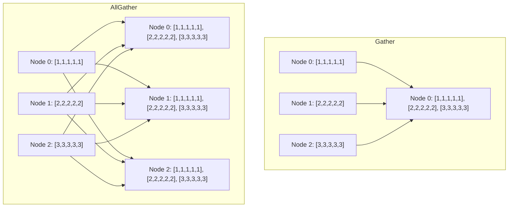
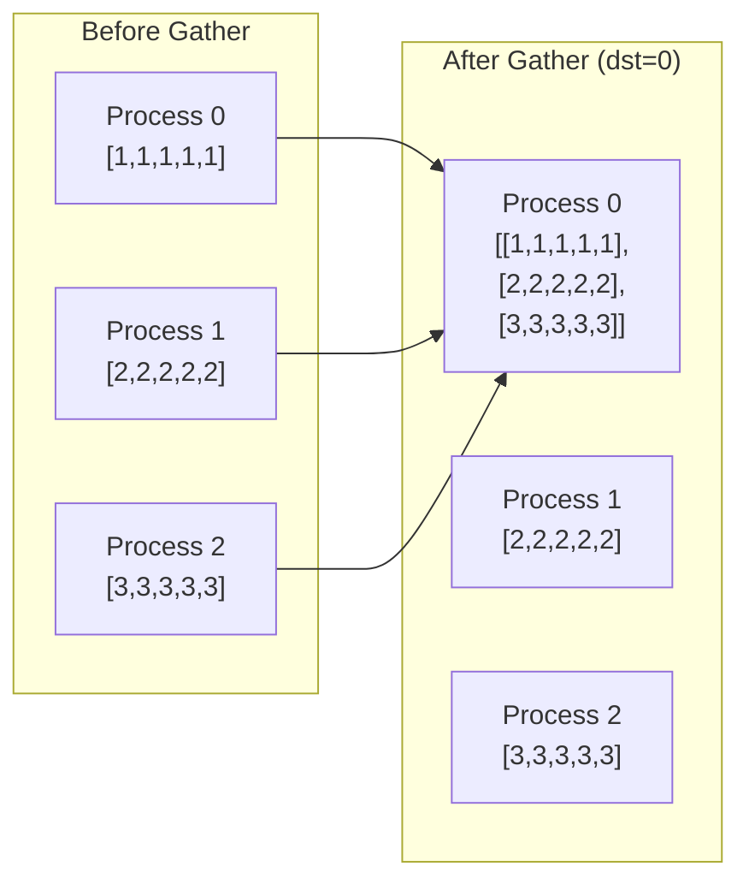
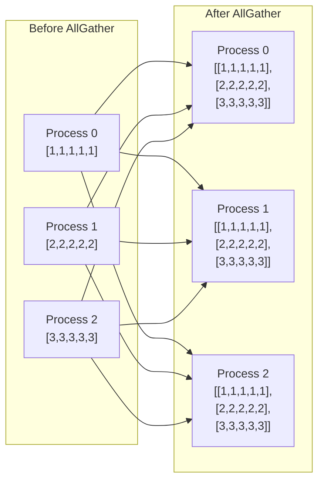
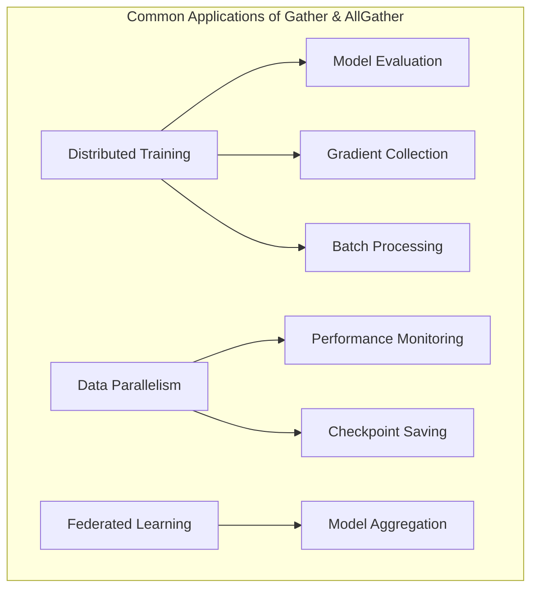

# Comprehensive Tutorial: Gather and AllGather in PyTorch Distributed

In distributed deep learning, efficient communication between processes is critical for performance. PyTorch provides collective communication primitives through its `torch.distributed` package, allowing tensors to be shared across processes. This tutorial focuses on two important collective operations: **Gather** and **AllGather**.

## Visual Representation of Gather and AllGather



The diagram above illustrates:
- **Gather**: All nodes send their data to a single destination node (Node 0)
- **AllGather**: All nodes send their data to all other nodes, so every node has a complete copy of all data

## Table of Contents
1. [Introduction to Distributed Computing Concepts](#introduction)
2. [Setting Up the Distributed Environment](#setup)
3. [Gather Operation](#gather)
   - [Basic Concepts](#gather-basics)
   - [Implementation Example](#gather-implementation)
   - [Advanced Usage](#gather-advanced)
4. [AllGather Operation](#allgather)
   - [Basic Concepts](#allgather-basics)
   - [Implementation Example](#allgather-implementation)
   - [Advanced Usage](#allgather-advanced)
5. [Practical Applications](#applications)
   - [Distributed Training](#training)
   - [Performance Considerations](#performance)
6. [Troubleshooting Common Issues](#troubleshooting)

<a id="introduction"></a>
## 1. Introduction to Distributed Computing Concepts

Distributed computing in deep learning involves splitting computation across multiple devices (GPUs) or nodes (machines). This approach enables training larger models and processing more data in parallel, but requires coordinating data between processes.

### Key Collective Operations

- **Broadcast**: Sends data from one process to all others
- **Reduce**: Combines data from all processes to one process using an operation
- **Gather**: Collects specific data from all processes to one process
- **AllGather**: Collects specific data from all processes to all processes
- **Scatter**: Distributes data from one process to all processes
- **AllReduce**: Combines data from all processes and distributes result to all

### Gather vs. AllGather

- **Gather**: Only the destination process receives the combined data
- **AllGather**: All processes receive the combined data (essentially Gather + Broadcast)

<a id="setup"></a>
## 2. Setting Up the Distributed Environment

Before using Gather or AllGather operations, we need to set up the distributed environment:

```python
import os
import torch
import torch.distributed as dist
import torch.multiprocessing as mp

def setup(rank, world_size):
    """
    Initialize the distributed environment.
    
    Args:
        rank: Unique identifier for the process
        world_size: Total number of processes
    """
    os.environ['MASTER_ADDR'] = 'localhost'
    os.environ['MASTER_PORT'] = '12355'
    
    # Initialize the process group
    dist.init_process_group("gloo", rank=rank, world_size=world_size)
    
def cleanup():
    """
    Clean up the distributed environment.
    """
    dist.destroy_process_group()
```

This setup code initializes the process group using the "gloo" backend, which works for both CPU and GPU operations. We'll use these `setup` and `cleanup` functions in all our examples.

<a id="gather"></a>
## 3. Gather Operation

<a id="gather-basics"></a>
### Basic Concepts

The `gather` operation collects tensors from multiple processes and concatenates them at a single destination process. The key components are:

- **Source tensor**: The local tensor from each process to be gathered
- **Destination rank**: The rank of the process where data will be gathered
- **Gather list**: A list of tensors at the destination to store received data (only needed at destination)



<a id="gather-implementation"></a>
### Implementation Example

Here's a basic example of using the `gather` operation:

```python
def run_gather_example(rank, world_size):
    # Initialize process group
    setup(rank, world_size)
    
    # Create a tensor with values specific to this rank
    tensor = torch.tensor([rank] * 5, dtype=torch.float32)
    print(f"Rank {rank} has data: {tensor}")
    
    # Create a list to gather results (only on destination rank)
    if rank == 0:
        gather_list = [torch.zeros(5, dtype=torch.float32) for _ in range(world_size)]
    else:
        gather_list = None
    
    # Perform gather operation
    dist.gather(tensor, gather_list, dst=0)
    
    # Print results (only on destination rank)
    if rank == 0:
        print(f"Rank 0 gathered data: {gather_list}")
    
    # Clean up
    cleanup()

# Launch processes
if __name__ == "__main__":
    world_size = 4
    mp.spawn(run_gather_example, args=(world_size,), nprocs=world_size)
```

This example:
1. Creates a tensor on each process with rank-specific values
2. Prepares a list to receive gathered tensors (only on rank 0)
3. Performs the gather operation to collect all tensors on rank 0
4. Displays the gathered data on rank 0

The output would look like:
```
Rank 0 has data: tensor([0., 0., 0., 0., 0.])
Rank 1 has data: tensor([1., 1., 1., 1., 1.])
Rank 2 has data: tensor([2., 2., 2., 2., 2.])
Rank 3 has data: tensor([3., 3., 3., 3., 3.])
Rank 0 gathered data: [tensor([0., 0., 0., 0., 0.]), 
                       tensor([1., 1., 1., 1., 1.]), 
                       tensor([2., 2., 2., 2., 2.]), 
                       tensor([3., 3., 3., 3., 3.])]
```

<a id="gather-advanced"></a>
### Advanced Usage

#### Gathering Variable-Sized Tensors

When gathering tensors of different sizes, you can use `gather_object`:

```python
def run_gather_variable_sized(rank, world_size):
    # Initialize process group
    setup(rank, world_size)
    
    # Create a tensor with different sizes per rank
    tensor = torch.ones(rank + 1, dtype=torch.float32) * rank
    print(f"Rank {rank} has data: {tensor}")
    
    # Prepare gather list (only on destination rank)
    if rank == 0:
        gather_list = [None] * world_size
    else:
        gather_list = None
    
    # Perform gather operation for objects
    dist.gather_object(tensor, gather_list, dst=0)
    
    # Print results (only on destination rank)
    if rank == 0:
        print(f"Rank 0 gathered data: {gather_list}")
    
    # Clean up
    cleanup()

if __name__ == "__main__":
    world_size = 4
    mp.spawn(run_gather_variable_sized, args=(world_size,), nprocs=world_size)
```

#### Custom Data Gathering

For more complex scenarios, you might need to gather custom data structures:

```python
def run_gather_custom_data(rank, world_size):
    # Initialize process group
    setup(rank, world_size)
    
    # Create custom data (e.g., a dict with tensor)
    data = {
        'rank': rank,
        'tensor': torch.ones(3, dtype=torch.float32) * rank,
        'metadata': f"Process {rank} info"
    }
    
    # Prepare gather list (only on destination rank)
    if rank == 0:
        gather_list = [None] * world_size
    else:
        gather_list = None
    
    # Perform gather operation for objects
    dist.gather_object(data, gather_list, dst=0)
    
    # Print results (only on destination rank)
    if rank == 0:
        for i, item in enumerate(gather_list):
            print(f"Rank 0 received from rank {i}: {item['metadata']}, tensor: {item['tensor']}")
    
    # Clean up
    cleanup()

if __name__ == "__main__":
    world_size = 4
    mp.spawn(run_gather_custom_data, args=(world_size,), nprocs=world_size)
```

<a id="allgather"></a>
## 4. AllGather Operation

<a id="allgather-basics"></a>
### Basic Concepts

The `all_gather` operation collects tensors from all processes and makes the result available to all processes. Key differences from `gather`:

- All processes receive the combined data
- All processes must provide a gather list
- No destination rank is specified (all are destinations)



<a id="allgather-implementation"></a>
### Implementation Example

Here's a basic example of the `all_gather` operation:

```python
def run_allgather_example(rank, world_size):
    # Initialize process group
    setup(rank, world_size)
    
    # Create a tensor with values specific to this rank
    tensor = torch.tensor([rank] * 5, dtype=torch.float32)
    print(f"Rank {rank} has data: {tensor}")
    
    # Create a list to gather results on all ranks
    gather_list = [torch.zeros(5, dtype=torch.float32) for _ in range(world_size)]
    
    # Perform all_gather operation
    dist.all_gather(gather_list, tensor)
    
    # Print results (on all ranks)
    print(f"Rank {rank} received data: {gather_list}")
    
    # Clean up
    cleanup()

# Launch processes
if __name__ == "__main__":
    world_size = 4
    mp.spawn(run_allgather_example, args=(world_size,), nprocs=world_size)
```

This example:
1. Creates a tensor on each process with rank-specific values
2. Prepares a list to receive gathered tensors on all ranks
3. Performs the all_gather operation to collect and distribute all tensors
4. Displays the gathered data on each rank

The output would include results from each rank showing that all processes received all data:
```
Rank 0 has data: tensor([0., 0., 0., 0., 0.])
Rank 1 has data: tensor([1., 1., 1., 1., 1.])
Rank 2 has data: tensor([2., 2., 2., 2., 2.])
Rank 3 has data: tensor([3., 3., 3., 3., 3.])

Rank 0 received data: [tensor([0., 0., 0., 0., 0.]), 
                       tensor([1., 1., 1., 1., 1.]), 
                       tensor([2., 2., 2., 2., 2.]), 
                       tensor([3., 3., 3., 3., 3.])]

Rank 1 received data: [tensor([0., 0., 0., 0., 0.]), 
                       tensor([1., 1., 1., 1., 1.]), 
                       tensor([2., 2., 2., 2., 2.]), 
                       tensor([3., 3., 3., 3., 3.])]

...etc for ranks 2 and 3...
```

<a id="allgather-advanced"></a>
### Advanced Usage

#### Gathering Variable-Sized Tensors

Similar to `gather_object`, `all_gather_object` handles variable-sized data:

```python
def run_allgather_variable_sized(rank, world_size):
    # Initialize process group
    setup(rank, world_size)
    
    # Create a tensor with different sizes per rank
    tensor = torch.ones(rank + 1, dtype=torch.float32) * rank
    print(f"Rank {rank} has data: {tensor}")
    
    # Prepare gather list for all ranks
    gather_list = [None] * world_size
    
    # Perform all_gather operation for objects
    dist.all_gather_object(gather_list, tensor)
    
    # Print results (on all ranks)
    print(f"Rank {rank} received data: {gather_list}")
    
    # Clean up
    cleanup()

if __name__ == "__main__":
    world_size = 4
    mp.spawn(run_allgather_variable_sized, args=(world_size,), nprocs=world_size)
```

#### Efficient Batch Processing with AllGather

AllGather is often used in distributed training to share batch elements across processes:

```python
def run_distributed_batch_processing(rank, world_size):
    # Initialize process group
    setup(rank, world_size)
    
    # Simulate a mini-batch that's divided across processes
    # Each process has batch_size/world_size samples
    local_batch_size = 4
    global_batch_size = local_batch_size * world_size
    
    # Create a local batch with unique data
    input_data = torch.randn(local_batch_size, 10)  # 10 features per sample
    labels = torch.randint(0, 2, (local_batch_size,))
    
    # Create placeholders for the gathered data
    all_input = [torch.zeros_like(input_data) for _ in range(world_size)]
    all_labels = [torch.zeros_like(labels) for _ in range(world_size)]
    
    # Gather data from all processes
    dist.all_gather(all_input, input_data)
    dist.all_gather(all_labels, labels)
    
    # Concatenate the gathered tensors
    all_input = torch.cat(all_input, dim=0)
    all_labels = torch.cat(all_labels, dim=0)
    
    # Now each process has the complete batch for processing
    print(f"Rank {rank}: Complete input shape: {all_input.shape}")
    print(f"Rank {rank}: Complete labels shape: {all_labels.shape}")
    
    # Further processing can be done with the complete batch
    # ...
    
    # Clean up
    cleanup()

if __name__ == "__main__":
    world_size = 4
    mp.spawn(run_distributed_batch_processing, args=(world_size,), nprocs=world_size)
```

<a id="applications"></a>
## 5. Practical Applications



<a id="training"></a>
### Distributed Training

One of the most common applications of Gather and AllGather is in distributed training. Here's an example using these operations in a distributed training loop:

```python
def run_distributed_training(rank, world_size):
    # Initialize process group
    setup(rank, world_size)
    
    # Create a simple model
    model = torch.nn.Linear(20, 10)
    
    # Wrap the model with DistributedDataParallel
    ddp_model = torch.nn.parallel.DistributedDataParallel(
        model, 
        device_ids=None,  # None for CPU training
        output_device=None
    )
    
    # Optimizer and loss function
    optimizer = torch.optim.SGD(ddp_model.parameters(), lr=0.01)
    criterion = torch.nn.CrossEntropyLoss()
    
    # Create a simulated dataset (different for each process)
    batch_size = 4
    features = torch.randn(batch_size, 20)
    labels = torch.randint(0, 10, (batch_size,))
    
    # Training loop
    for epoch in range(3):
        # Forward pass
        outputs = ddp_model(features)
        loss = criterion(outputs, labels)
        
        # Backward pass and optimize
        optimizer.zero_grad()
        loss.backward()
        optimizer.step()
        
        # Gather predictions from all processes for evaluation
        all_outputs = [torch.zeros_like(outputs) for _ in range(world_size)]
        all_labels = [torch.zeros_like(labels) for _ in range(world_size)]
        
        dist.all_gather(all_outputs, outputs)
        dist.all_gather(all_labels, labels)
        
        # Process 0 computes metrics on the full dataset
        if rank == 0:
            all_outputs = torch.cat(all_outputs, dim=0)
            all_labels = torch.cat(all_labels, dim=0)
            _, predicted = torch.max(all_outputs, 1)
            accuracy = (predicted == all_labels).sum().item() / len(all_labels)
            print(f"Epoch {epoch}: Loss: {loss.item():.4f}, Accuracy: {accuracy:.4f}")
    
    # Clean up
    cleanup()

if __name__ == "__main__":
    world_size = 4
    mp.spawn(run_distributed_training, args=(world_size,), nprocs=world_size)
```

<a id="performance"></a>
### Performance Considerations

When using Gather and AllGather operations, keep these performance tips in mind:

```python
def demonstrate_performance_tips(rank, world_size):
    # Initialize process group
    setup(rank, world_size)
    
    # TIP 1: Use the right backend for your hardware
    # gloo for CPU, NCCL for GPU
    
    # TIP 2: Minimize the amount of data transferred
    # Instead of:
    large_tensor = torch.randn(10000, 1000)
    gathered_large = [torch.zeros_like(large_tensor) for _ in range(world_size)]
    dist.all_gather(gathered_large, large_tensor)
    
    # Consider transferring only what's needed:
    important_stats = torch.sum(large_tensor, dim=1)  # Much smaller tensor
    gathered_stats = [torch.zeros_like(important_stats) for _ in range(world_size)]
    dist.all_gather(gathered_stats, important_stats)
    
    # TIP 3: Overlap computation and communication
    # Compute something else while waiting for gather to complete
    
    # TIP 4: Use asynchronous operations when possible
    # Example with all_gather_into_tensor (more efficient)
    if hasattr(dist, 'all_gather_into_tensor'):  # Available in newer PyTorch versions
        output_tensor = torch.zeros(world_size * 5, dtype=torch.float32)
        input_tensor = torch.ones(5, dtype=torch.float32) * rank
        
        # This is more efficient than regular all_gather
        dist.all_gather_into_tensor(output_tensor, input_tensor)
        print(f"Rank {rank} efficient all_gather result: {output_tensor}")
    
    # Clean up
    cleanup()

if __name__ == "__main__":
    world_size = 4
    mp.spawn(demonstrate_performance_tips, args=(world_size,), nprocs=world_size)
```: Minimize the amount of data transferred
    # Instead of:
    large_tensor = torch.randn(10000, 1000).cuda()
    gathered_large = [torch.zeros_like(large_tensor) for _ in range(world_size)]
    dist.all_gather(gathered_large, large_tensor)
    
    # Consider transferring only what's needed:
    important_stats = torch.sum(large_tensor, dim=1).cuda()  # Much smaller tensor
    gathered_stats = [torch.zeros_like(important_stats) for _ in range(world_size)]
    dist.all_gather(gathered_stats, important_stats)
    
    # TIP 3: Overlap computation and communication
    # Compute something else while waiting for gather to complete
    
    # TIP 4: Use asynchronous operations when possible
    # Example with all_gather_into_tensor (more efficient)
    if hasattr(dist, 'all_gather_into_tensor'):  # Available in newer PyTorch versions
        output_tensor = torch.zeros(world_size * 5, dtype=torch.float32).cuda()
        input_tensor = torch.ones(5, dtype=torch.float32).cuda() * rank
        
        # This is more efficient than regular all_gather
        dist.all_gather_into_tensor(output_tensor, input_tensor)
        print(f"Rank {rank} efficient all_gather result: {output_tensor}")
    
    # Clean up
    cleanup()
```

<a id="troubleshooting"></a>
## 6. Troubleshooting Common Issues

Here are solutions to common problems when working with Gather and AllGather:

```python
def troubleshooting_examples(rank, world_size):
    # Initialize process group
    setup(rank, world_size)
    
    # ISSUE 1: Mismatch in tensor sizes
    try:
        if rank == 0:
            tensor = torch.ones(10)
        else:
            tensor = torch.ones(5)  # Different size!
            
        # This will fail with an error
        gather_list = [torch.zeros(10) for _ in range(world_size)]
        dist.all_gather(gather_list, tensor)
    except Exception as e:
        print(f"Rank {rank} caught error: {e}")
        # FIX: Ensure all tensors have the same size or use all_gather_object
    
    # ISSUE 2: Deadlock due to wrong dst rank in gather
    try:
        tensor = torch.ones(5) * rank
        
        # Only rank 0 prepares gather list, but dst is set to rank 1
        if rank == 0:
            gather_list = [torch.zeros(5) for _ in range(world_size)]
        else:
            gather_list = None
            
        # This will hang because rank 1 doesn't have a gather_list
        # dist.gather(tensor, gather_list, dst=1)
        
        # FIX: Ensure the dst rank has a proper gather_list
        if rank == 1:  # Change check to match dst
            gather_list = [torch.zeros(5) for _ in range(world_size)]
        else:
            gather_list = None
            
        # Now this works
        dist.gather(tensor, gather_list, dst=1)
        
        if rank == 1:
            print(f"Fixed gather on rank 1: {gather_list}")
    except Exception as e:
        print(f"Rank {rank} caught error: {e}")
    
    # ISSUE 3: Handling uneven data in allgather
    try:
        # Create tensors with different shapes based on rank
        local_size = rank + 1
        tensor = torch.ones(local_size)
        
        # This won't work with regular all_gather
        # Instead, use all_gather_object
        gather_list = [None] * world_size
        dist.all_gather_object(gather_list, tensor)
        
        print(f"Rank {rank} successfully gathered tensors of different sizes: {[t.size() for t in gather_list]}")
    except Exception as e:
        print(f"Rank {rank} caught error: {e}")
    
    # ISSUE 4: Process group initialization issues
    try:
        # If you get errors about process group not initialized
        # Make sure setup() is called before any dist operations
        if not dist.is_initialized():
            print(f"Rank {rank}: Process group not initialized!")
            # FIX: Call setup() before any distributed operations
    except Exception as e:
        print(f"Rank {rank} caught error: {e}")
    
    # ISSUE 5: Timeout issues in distributed operations
    try:
        # If operations timeout, you may need to increase the timeout
        # Original dist.init_process_group has a default timeout
        # You can set a longer timeout:
        # dist.init_process_group("gloo", rank=rank, world_size=world_size, timeout=datetime.timedelta(seconds=3600))
        
        # For large tensors, operations may take longer
        large_tensor = torch.randn(1000000)
        gather_list = [torch.zeros_like(large_tensor) for _ in range(world_size)]
        
        # Use non-blocking operations when possible
        req = dist.all_gather(gather_list, large_tensor, async_op=True)
        # Do other computation here
        req.wait()  # Wait for the operation to complete
        
        print(f"Rank {rank}: Successfully handled large tensor gather")
    except Exception as e:
        print(f"Rank {rank} caught error: {e}")
    
    # Clean up
    cleanup()

if __name__ == "__main__":
    world_size = 4
    mp.spawn(troubleshooting_examples, args=(world_size,), nprocs=world_size)
```

## 7. Practical Example: Distributed Model Training

Let's put everything together with a complete example that demonstrates how to use Gather and AllGather in a distributed training scenario:

```python
import os
import torch
import torch.distributed as dist
import torch.multiprocessing as mp
import torch.nn as nn
import torch.nn.functional as F
import torch.optim as optim
from torch.utils.data import DataLoader, TensorDataset
from torch.utils.data.distributed import DistributedSampler

def setup(rank, world_size):
    os.environ['MASTER_ADDR'] = 'localhost'
    os.environ['MASTER_PORT'] = '12355'
    dist.init_process_group("gloo", rank=rank, world_size=world_size)

def cleanup():
    dist.destroy_process_group()

class SimpleModel(nn.Module):
    def __init__(self):
        super(SimpleModel, self).__init__()
        self.fc1 = nn.Linear(784, 256)
        self.fc2 = nn.Linear(256, 64)
        self.fc3 = nn.Linear(64, 10)
        
    def forward(self, x):
        x = x.view(-1, 784)
        x = F.relu(self.fc1(x))
        x = F.relu(self.fc2(x))
        x = self.fc3(x)
        return x

def run_training(rank, world_size):
    print(f"Running training on rank {rank}.")
    setup(rank, world_size)
    
    # Create dummy dataset
    data_size = 1000
    feature_size = 784  # 28x28 images
    dataset = TensorDataset(
        torch.randn(data_size, feature_size),
        torch.randint(0, 10, (data_size,))
    )
    
    # Create distributed sampler
    sampler = DistributedSampler(dataset, 
                                num_replicas=world_size,
                                rank=rank,
                                shuffle=True)
    
    # Create dataloader
    batch_size = 32
    dataloader = DataLoader(dataset, 
                            batch_size=batch_size,
                            sampler=sampler)
    
    # Create model
    model = SimpleModel()
    
    # Wrap model with DDP
    ddp_model = nn.parallel.DistributedDataParallel(model, 
                                                   device_ids=None,  # None for CPU
                                                   output_device=None)
    
    # Define loss function and optimizer
    criterion = nn.CrossEntropyLoss()
    optimizer = optim.SGD(ddp_model.parameters(), lr=0.01)
    
    # Training loop
    num_epochs = 3
    for epoch in range(num_epochs):
        sampler.set_epoch(epoch)  # Important for proper shuffling
        running_loss = 0.0
        
        for i, (inputs, labels) in enumerate(dataloader):
            # Forward pass
            outputs = ddp_model(inputs)
            loss = criterion(outputs, labels)
            
            # Backward and optimize
            optimizer.zero_grad()
            loss.backward()
            optimizer.step()
            
            running_loss += loss.item()
            
            if i % 10 == 9:
                print(f"Rank {rank}, Epoch {epoch+1}, Batch {i+1}, Loss: {running_loss/10:.4f}")
                running_loss = 0.0
        
        # After each epoch, gather validation metrics from all processes
        # For this example, we'll just gather the model's weights
        state_dict = {k: v.cpu() for k, v in ddp_model.state_dict().items()}
        
        # Each rank will check one parameter
        param_to_check = list(state_dict.keys())[0]
        local_param = state_dict[param_to_check]
        
        # Gather this parameter from all ranks
        gathered_params = [torch.zeros_like(local_param) for _ in range(world_size)]
        dist.all_gather(gathered_params, local_param)
        
        # Check if models are synchronized (they should be in DDP)
        if rank == 0:
            are_equal = all(torch.allclose(gathered_params[0], p) for p in gathered_params[1:])
            print(f"Epoch {epoch+1} complete. Models synchronized: {are_equal}")
    
    # Gather final predictions on the whole dataset
    # Here we'll demonstrate by making predictions on just a small batch
    test_inputs = torch.randn(10, feature_size)
    with torch.no_grad():
        predictions = ddp_model(test_inputs).argmax(dim=1)
    
    # Gather predictions from all ranks
    all_predictions = [torch.zeros_like(predictions) for _ in range(world_size)]
    dist.all_gather(all_predictions, predictions)
    
    # Rank 0 can now process all predictions
    if rank == 0:
        all_predictions = torch.cat(all_predictions)
        print(f"Final gathered predictions shape: {all_predictions.shape}")
    
    # Clean up
    cleanup()
    print(f"Rank {rank} completed training.")

if __name__ == "__main__":
    world_size = 4
    mp.spawn(run_training, args=(world_size,), nprocs=world_size)
```

This comprehensive tutorial provides a thorough understanding of Gather and AllGather operations in PyTorch distributed computing, from basic concepts to advanced implementations and real-world applications.